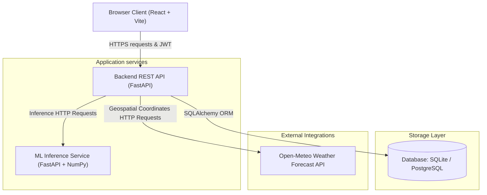

# Krishi Saathi: AI-Enabled Precision Advisory Platform

[](#)
[](https://fastapi.tiangolo.com)
[](https://react.dev)
[](https://www.docker.com)
[](#)

**Krishi Saathi** (Hindi for *Farmer's Friend*) is a comprehensive precision agriculture platform designed to bridge the yield gap in Indian oilseed cultivation. By leveraging machine learning models, real-time satellite imagery simulation, GIS mapping, and live weather conditions, the platform empowers farmers and agricultural officials with actionable, personalized advisories to optimize productivity, conserve resources, and predict yields.

Developed by **Dharmesh Singhal**, this project provides a robust, scalable multi-service architecture ready for production deployment.

---

## 🚀 Live Deployments

*   **Frontend Web Application (Vercel):** [https://krishi-saathi-git-main-drat47s-projects.vercel.app/](https://krishi-saathi-git-main-drat47s-projects.vercel.app/)
*   **Backend REST API Service (Render):** [https://krishi-saathi-bb2a.onrender.com](https://krishi-saathi-bb2a.onrender.com)
*   **Interactive API Documentation (Swagger UI):** [https://krishi-saathi-bb2a.onrender.com/docs](https://krishi-saathi-bb2a.onrender.com/docs)

---

## 📖 Table of Contents
1. [Core Features](#-core-features)
2. [System Architecture](#-system-architecture)
3. [Tech Stack](#-tech-stack)
4. [Database Schema](#-database-schema)
5. [Quick Start & Setup](#-quick-start--setup)
    - [Prerequisites](#prerequisites)
    - [Docker Compose Installation (Recommended)](#docker-compose-installation-recommended)
    - [Manual Local Development](#manual-local-development)
6. [Configuration & Environment Variables](#-configuration--environment-variables)
7. [Deployment Guide](#-deployment-guide)
8. [API Endpoints & Interactive Documentation](#-api-endpoints--interactive-documentation)
9. [Author](#-author)

---

## 🌟 Core Features

*   **🌾 Interactive Farmer Dashboard**: Centralized hub presenting a comprehensive view of all registered farm fields, land dimensions, active crops, and district details.
*   **🛰️ GIS Satellite Mapping**: Built-in Leaflet-based geospatial maps utilizing Esri High-Resolution World Imagery tiles to visually demarcate, zoom, and interact with field coordinates.
*   **📊 Interactive Yield Analytics**: Historical vs. benchmark yield comparisons using visual line charts and district/state/global benchmarking bar graphs (rendered responsively with Recharts).
*   **☁️ Open-Meteo Weather API Integration**: Fetches real-time, location-based current weather parameters (temperature, relative humidity, rain precipitation, wind speed) based on the field's latitude and longitude.
*   **🤖 AI-Driven Precision Advisories**: Custom ML Service that computes crop yield predictions, evaluates confidence, calculates yield gaps compared to optimal potential, and generates localized category-based recommendations (Irrigation, Fertilizer application, Pest management).
*   **📈 Indian Mandi Price Ticker**: Real-time ticker simulating live crop price listings and trend movements (up/down) for essential crops (Soybean, Groundnut, Mustard, Sunflower, Cotton).
*   **🔐 Secure Role-Based Access**: Role-based access control (Farmer, Admin, Official) protected with JWT (JSON Web Token) bearer authentication, hashed passwords (bcrypt), and secure registration protocols.

---

## 🏗️ System Architecture

The Krishi Saathi platform is structured as a modular microservices architecture, promoting high scalability, clean isolation of concerns, and ease of deployment:



### Flow of Data:
1. **User Authentication**: Client obtains a JWT access token via `/auth/token`. Subsequent API requests include the token in HTTP Headers (`Authorization: Bearer <token>`).
2. **Weather Fetching**: Backend acts as a secure proxy to request current location forecasts from Open-Meteo API using the field's GPS coordinates.
3. **Advisory Generation**: When generating an advisory, the Backend compiles field information and calls the ML Inference service's `/predict` endpoint to process yield gap modeling, returning structured crop recommendations.

---

## 🛠️ Tech Stack

### Frontend
- **Framework**: React.js v18 (built with [Vite](https://vitejs.dev/))
- **Styling**: Vanilla CSS with customized modern theme grids and layouts
- **Mapping**: Leaflet API via [React-Leaflet](https://react-leaflet.js.org/) (Satellite layer sourced from Esri World Imagery)
- **Charts & Visuals**: Recharts (fully responsive SVG charts)
- **State & Networking**: Axios with localStorage token persistence

### Backend API
- **Framework**: FastAPI (Asynchronous Python REST framework)
- **ORM**: SQLAlchemy
- **Authentication**: JWT (JSON Web Tokens), `python-jose`, and `passlib[bcrypt]`
- **Documentation**: Automatic OpenAPI generation (Swagger UI & ReDoc)

### ML Service
- **Framework**: FastAPI (highly optimized lightweight endpoints)
- **Science & Modeling**: NumPy (numerical variance and crop gap prediction modelling)

### Database
- **Development**: SQLite (`krishi_saathi.db`)
- **Production**: PostgreSQL (Render PostgreSQL / Neon / Supabase)

---

## 🗄️ Database Schema

SQLAlchemy models map the relational structure shown below:

```
+------------------+         +------------------+
|      users       |         |      fields      |
+------------------+         +------------------+
| id (PK, Int)     |<-------+| id (PK, Int)     |
| username (Str)   |         | name (Str)       |
| hashed_pwd (Str) |         | district (Str)   |
| role (Str)       |         | area_ha (Float)  |
+------------------+         | latitude (Float) |
                             | longitude (Float)|
                             | crop_type (Str)  |
                             | owner_id (FK)    |
                             | created_at (DT)  |
                             +------------------+
                               |              |
         +---------------------+              +----------------------+
         |                                                           |
         v                                                           v
+------------------+                                        +------------------+
|    crop_data     |                                        |    advisories    |
+------------------+                                        +------------------+
| id (PK, Int)     |                                        | id (PK, Int)     |
| field_id (FK)    |                                        | field_id (FK)    |
| date (DT)        |                                        | date (DT)        |
| ndvi (Float)     |                                        | content (Text)   |
| rainfall (Float) |                                        | priority (Str)   |
| temp (Float)     |                                        | category (Str)   |
| moisture (Float) |                                        +------------------+
+------------------+
```

---

## 🚀 Quick Start & Setup

### Prerequisites
- Install **Docker** and **Docker Compose** (Recommended) OR
- Install **Python 3.10+** and **Node.js 18+** (For manual setup)

---

### Docker Compose Installation (Recommended)

To stand up the entire multi-service stack (Frontend, Backend, ML Service, Database) locally inside containers with a single command:

1. Clone the repository and navigate to the project directory:
   ```bash
   git clone https://github.com/Drat47/Krishi-Saathi.git
   cd Krishi-Saathi
   ```

2. Run Docker Compose build and daemon:
   ```bash
   docker-compose up -d --build
   ```

3. Open your browser and navigate to:
   - **Web Application**: `http://localhost:3000`
   - **Backend API Docs**: `http://localhost:8000/docs`
   - **ML Service Status**: `http://localhost:5000/`

4. To tear down the services:
   ```bash
   docker-compose down
   ```

---

### Manual Local Development

If you prefer to run the services individually without Docker:

#### 1. Setup ML Service
```bash
cd ml_service
python -m venv .venv
source .venv/bin/activate  # On Windows use: .venv\Scripts\activate
pip install -r requirements.txt
uvicorn main:app --host 0.0.0.0 --port 5000 --reload
```

#### 2. Setup Backend API
```bash
cd backend
python -m venv .venv
source .venv/bin/activate  # On Windows use: .venv\Scripts\activate
pip install -r requirements.txt
# Run the database seeder to inject default credentials and fields
python seed.py
uvicorn main:app --host 0.0.0.0 --port 8000 --reload
```

#### 3. Setup Frontend
```bash
cd frontend
npm install
npm run dev
```
Navigate to `http://localhost:3000` to interact with the UI.

---

## 👤 Default Credentials
During seeding, the database is populated with an initial demo account:
- **Username**: `admin`
- **Password**: `password123`

---

## ⚙️ Configuration & Environment Variables

The application services load settings dynamically from environment variables:

| Service | Variable Name | Default Value | Description |
| :--- | :--- | :--- | :--- |
| **Backend** | `DATABASE_URL` | `sqlite:///./data/krishi_saathi.db` | Connection string for database (PostgreSQL in production) |
| **Backend** | `ALLOWED_ORIGINS` | `http://localhost:3000` | Comma-separated list of origins permitted to access API |
| **Backend** | `ML_SERVICE_URL` | `http://localhost:5000` | Connection address for the ML Inference Service |
| **Frontend** | `VITE_API_URL` | `http://localhost:8000` | Target URL for making API requests to backend |

---

## ☁️ Deployment Guide

The code is prepared out-of-the-box for production deployment:

### Backend & ML Service (Render)
1. Navigate to the [Render Dashboard](https://dashboard.render.com).
2. Click **New** -> **Blueprint**.
3. Connect your GitHub repository.
4. Render will parse the [render.yaml](render.yaml) file automatically to set up two Web Services:
   - `krishi-saathi-ml` (ML Service)
   - `krishi-saathi-backend` (FastAPI backend API)
5. **Database Configuration**: To transition from ephemeral SQLite to persistent storage, deploy a PostgreSQL database on Render. Update the backend service environment variables to point `DATABASE_URL` to your PostgreSQL database connection string.

### Frontend (Vercel)
1. Go to the [Vercel Dashboard](https://vercel.com) and click **Add New** -> **Project**.
2. Select your repository.
3. In project configuration:
   - **Root Directory**: `frontend`
   - **Framework Preset**: `Vite`
4. Expand **Environment Variables** and add:
   - `VITE_API_URL` = `https://krishi-saathi-bb2a.onrender.com`
5. Click **Deploy**. Vercel will use the [vercel.json](frontend/vercel.json) configuration to ensure all client side routes resolve to `index.html` (SPA routing compatibility).

---

## 🔌 API Endpoints & Interactive Documentation

FastAPI automatically generates interactive document pages detailing schemas, parameters, responses, and authorization endpoints. Once the backend is running, access:

- **Swagger UI**: [https://krishi-saathi-bb2a.onrender.com/docs](https://krishi-saathi-bb2a.onrender.com/docs)
- **ReDoc**: [https://krishi-saathi-bb2a.onrender.com/redoc](https://krishi-saathi-bb2a.onrender.com/redoc)

### Summary of Key Endpoints:
- `POST /auth/register` - Register a new farmer account
- `POST /auth/token` - Authenticate credentials and receive JWT token
- `GET /fields/` - List all fields belonging to current user
- `POST /fields/` - Register a new field (gps coordinates, area, name)
- `GET /advisory/{field_id}` - Fetch custom advisories for a field
- `POST /advisory/{field_id}` - Generate a new advisory using ML yield simulation
- `GET /weather/?latitude={lat}&longitude={lng}` - Live Open-Meteo current forecast proxy
- `GET /market/prices` - Simulated Mandi listings

---

## 👤 Author

*   **Dharmesh Singhal** - *Lead Architect & Developer* - [GitHub Profile](https://github.com/Drat47)

---
*Empowering Indian Agriculture through AI & Precision Technology.*
